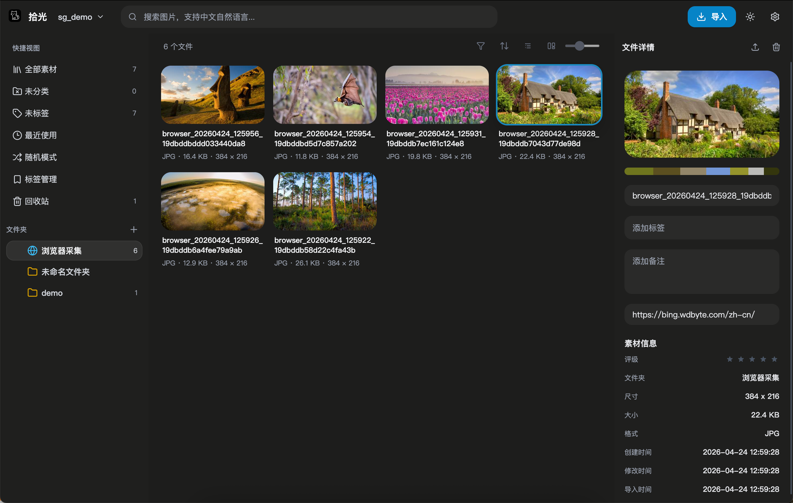

# 拾光

桌面素材管理工具。为设计师而生的图片收集与整理工具，助你高效管理设计素材。

> [!IMPORTANT]
> 目前功能尚未开发完毕且存在大量 bug，且勿投入使用。正式生产使用请耐心等待 1.0.0~~

## 什么是拾光？

拾光是一款本地素材管理工具，特别适合需要收集和整理图片的设计师。你可以：

- 从多个文件夹导入素材，统一管理
- 给图片打标签、评星级
- 快速搜索想要的素材
- 拖拽或粘贴图片到应用中
- 用浏览器插件一键采集网页图片

## 支持平台

- Windows 10 及以上
- macOS 10.15 及以上
- Linux

## 快速开始

### 下载安装

从 [Releases](https://github.com/zihuv/shiguang/releases) 下载对应平台的安装包。

### 浏览器插件（可选）

如果你需要从网页采集图片：

1. 打开 `extensions/shiguang-collector` 目录
2. 在 Chrome/Edge 中打开 `chrome://extensions/`
3. 开启「开发者模式」
4. 点击「加载已解压的扩展程序」
5. 选择 `extensions/shiguang-collector` 目录

使用：右键点击网页，选择「采集」，图片会自动保存到「浏览器采集」文件夹。

## 常见问题

**Q: 导入的图片会复制到应用目录吗？**
A: 不会。拾光只会扫描你指定的文件夹路径，保留原始文件位置。

**Q: 删除了应用，素材会丢失吗？**
A: 不会。素材文件都在你原本的文件夹中，应用只是建立索引。

**Q: 支持哪些图片格式？**
A: 支持常见格式：JPG、PNG、GIF、WebP、BMP、SVG 等。
